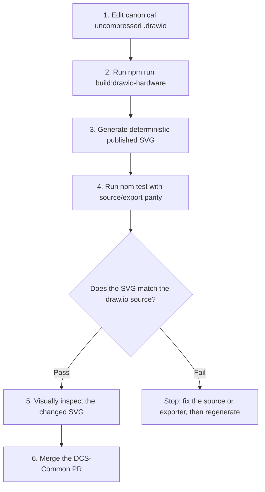
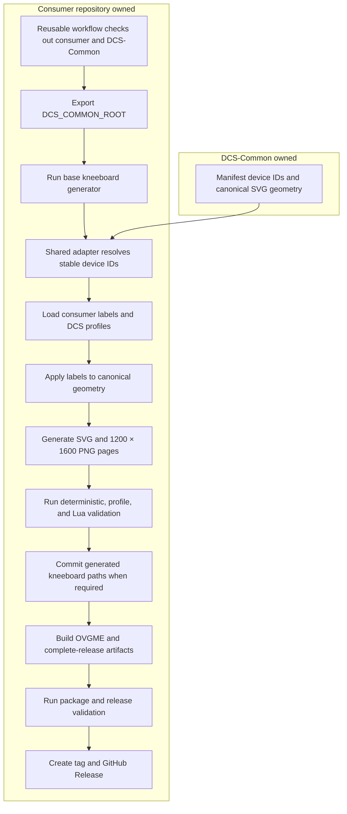

# DCS-Common

This repository hosts a shared kneeboard rendering pipeline for DCS component repos, plus the **DCS Input Profile Importer** scaffold tooling.

## Requirements

- Node.js 22
- npm
- For the Windows importer UI: .NET 10 SDK (dev) / Node on PATH (runtime)

## Local validation

```bash
npm ci
npm test
```

To regenerate and validate the shared hardware catalog:

```bash
npm run build:shared-hardware
npm run build:drawio-hardware
npm run test:shared-hardware
```

Image-backed hardware templates use native draw.io sources. See [the draw.io hardware workflow](docs/drawio-hardware-workflow.md) before editing them.

## New consumer repositories

**Preferred:** [DCS Input Profile Importer](tools/DcsConsumerScaffold/) (WPF) or the CLI engine:

```bash
node scripts/scaffold-consumer.mjs \
  --output-dir ./DCS-Example-Components \
  --profiles-dir "/path/to/Config/Input/<module>/joystick" \
  --modifiers "/path/to/Config/Input/<module>/modifiers.lua" \
  --display-name "Example" \
  --input-module-id ExampleModule \
  --kneeboard-id ExampleModule
```

Then refine `config/kneeboard.json` and follow the [consumer repository setup guide](docs/consumer-repository-setup.md).

Using DCS modifiers (hold or toggle) with layered kneeboard pages? See [profile-driven kneeboards — operator workflow](docs/profile-driven-kneeboards.md) and the [toggle-layer fixture](examples/modifiers-toggle-layer/).

App CI/release (four-part tags `vX.X.X.X`, Inno Setup): [scaffold-app.yml](.github/workflows/scaffold-app.yml) via [shared-github-workflows](https://github.com/ScottyMac52/shared-github-workflows). Plan notes: [project plan](docs/project-plans/consumer-scaffold-wpf.md).

## Authoring and release workflows

### DCS-Common shared-hardware authoring

The uncompressed draw.io file is the canonical visual source. Its SVG is a deterministic published output, and parity validation prevents a stale export from being merged.



### Consumer build and release

Consumer repositories own aircraft labels, DCS profiles, packaging, and releases. They consume stable device IDs and canonical geometry from DCS-Common.



Changing DCS-Common does not rewrite an existing consumer release. A consumer receives updated shared assets only when its kneeboard is rebuilt or re-released from the updated catalog. See the [shared workflow contract](docs/workflow-contract.md) and [profile-driven kneeboard guide](docs/profile-driven-kneeboards.md) for consumer setup details.


## Shared kneeboard renderer

Consumer repositories can define a config object with:

- an asset map for local or embedded image sources
- a list of summary and hardware pages
- per-page metadata, callouts, notes, and image layers

The shared renderer in scripts/kneeboard-renderer.mjs renders deterministic SVG output and optional PNG output from that contract.

Use the example config in examples/f14b-config.mjs and the render script in scripts/render-kneeboard-example.mjs to validate the flow locally.

## Shared hardware catalog

The shared hardware catalog lives under assets/shared/hardware and is indexed by assets/shared/hardware/manifest.json.

Each entry contains:

- an id for downstream lookup
- a label for the hardware family
- an SVG template that preserves the underlying control image/diagram as the base layer
- a complete Lua physical-input catalog; downstream repositories provide separate aircraft-specific mappings

Downstream repositories should consume these shared templates instead of recreating the same control images and placeholder hotspots locally. The shared assets are designed to be imported into the consumer repo as a base layer, then aligned to the repo-specific button and label positions as needed.

Manifest device IDs identify hardware types, not individual physical units. A consumer with multiple units—such as MFD 1/2/3 or two Logitech throttle quadrants—should render the same canonical device ID multiple times and supply independent instance IDs and labels through `renderSharedHardwareInstancesPage`. Do not duplicate the shared draw.io or SVG definition for each physical unit.

Example consumer pattern:

```js
import { readFileSync } from 'node:fs';

const manifest = JSON.parse(readFileSync('assets/shared/hardware/manifest.json', 'utf8'));
const template = manifest.devices.find((device) => device.id === 'vkb-f14-gunfighter');
console.log(template?.svg);
```


### Lua physical-input contract

Shared Lua definitions describe hardware capabilities, not aircraft functions. Each complete device catalog uses stable control IDs that match its draw.io connector IDs and exported SVG callout IDs, plus the physical DCS input key, control type, and hardware label. Maintained positions, rocker halves, encoder directions, buttons, and axes are represented independently when the device exposes them as distinct inputs.

Aircraft-specific command IDs, module functions, and user bindings belong in consumer repositories. Consumers map their aircraft functions to the shared control IDs and may render multiple physical instances from one device definition. `lua/tm-mfd.lua` is the reference schema for completing the remaining device catalogs.


#### Completing a legacy Lua catalog

A Lua definition is considered complete only when it declares `schemaVersion = 1`. To migrate a legacy stub:

1. Verify every native physical input against authoritative documentation and an actual device enumeration.
2. Give every independently exposed button, switch position, hat direction, encoder direction, and axis its own control entry.
3. Match each control ID to one draw.io connector and one exported SVG callout.
4. Remove aircraft-specific command identifiers and keep those mappings in consumer repositories.
5. Run `npm run build:drawio-hardware`, `npm test`, and `npm run test:shared-hardware`.

The shared-hardware test automatically validates every schema-versioned catalog. Non-versioned files remain visible as legacy incomplete catalogs until they are deliberately verified and migrated.
